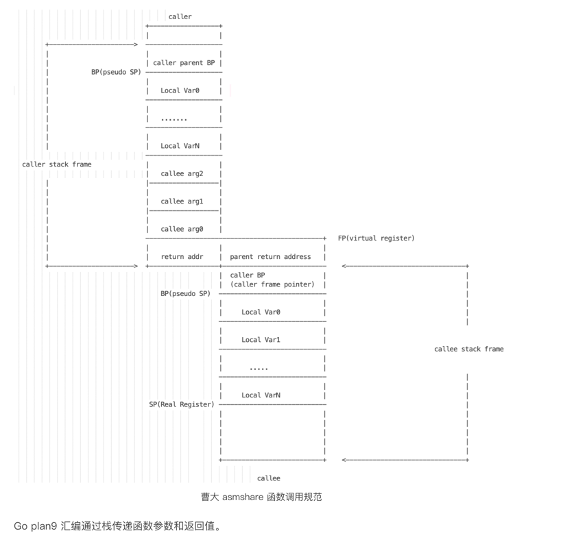
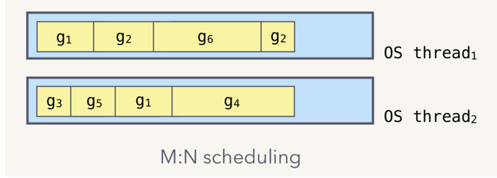
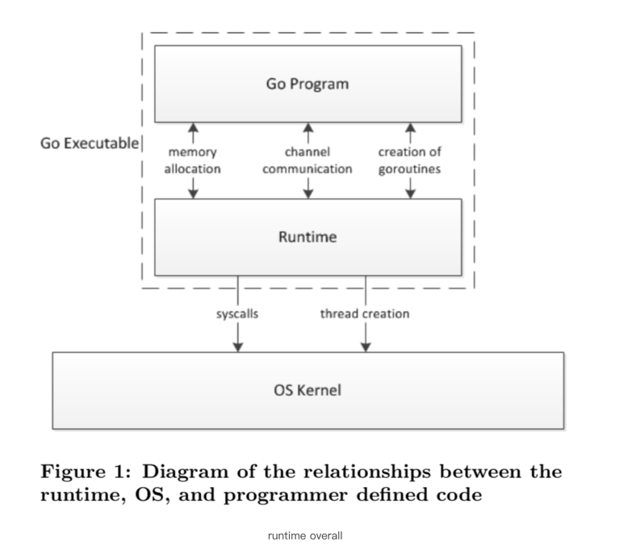

# Scheduler

https://qcrao.com/2019/09/02/dive-into-go-scheduler/
https://tonybai.com/
https://github.com/draveness
https://github.com/Bingjian-Zhu
https://github.com/bosun-monitor/bosun/
https://dave.cheney.net/
https://stackoverflow.blog/2020/11/02/go-golang-learn-fast-programming-languages/
https://blog.feedspot.com/golang_blogs/
https://presstige.io/p/dailyrotate-a-Go-library-for-rotating-files-daily-6fb283a94e604f879e0d97a5f788dee6
https://golangweekly.com/
https://github.com/darjun/go-daily-lib
https://github.com/qiyeboy?tab=repositories

